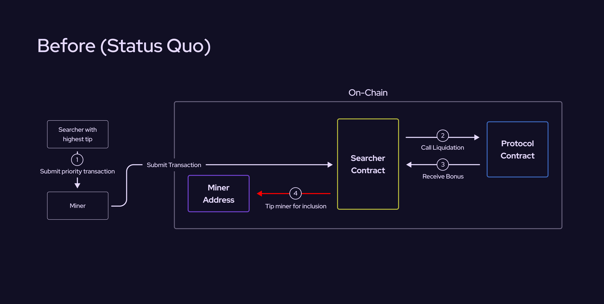
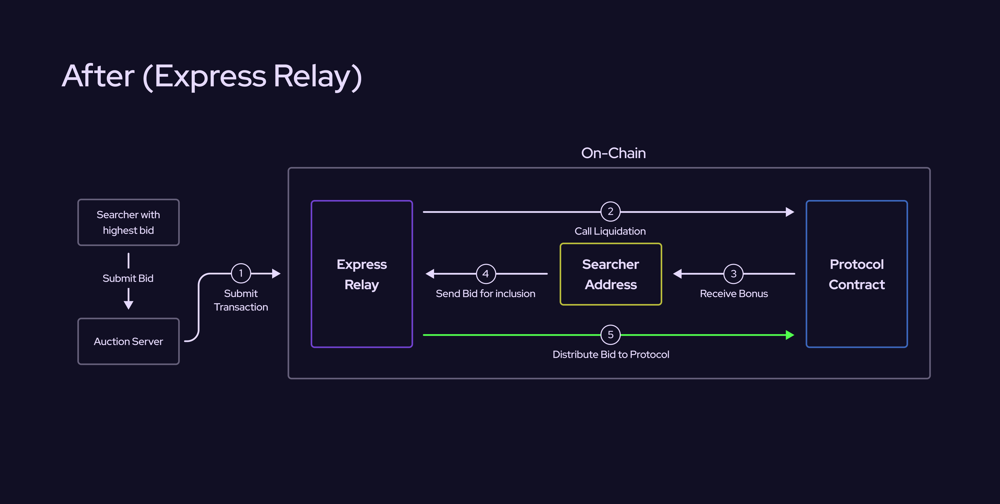

Express Relay allows protocols to eliminate [Maximal Extractable Value](https://www.ledger.com/academy/glossary/maximal-extractable-value-mev) (MEV).
Many protocols generate MEV on a regular basis.
For example, borrow-lending protocols provide bonuses to searchers for liquidating undercollateralized loans.
Searchers compete for these bonuses by tipping the chain's miners or validators.
The validators capture most of the value of the liquidation bonus via these tips, so the liquidation bonus is in essence a transfer of wealth from the protocol's users to the validators in the form of tips.

Express Relay solves the problem of MEV by providing protocol developers with an [auction](./how-express-relay-works/auction) primitive that they can use to prioritize access to valuable protocol operations.
Developers specify a set of operations in their protocol that must be accessed through Express Relay.
Searchers then participate in an off-chain auction to access these operations.
Their bids in the auction are used to determine the order in which their transactions will be executed.
The winners' transactions are forwarded to the Express Relay smart contract. As part of the transaction, searchers must pay their specified bid.
The auction profits are then split between the integrated protocol and other participants in Express Relay.

The diagram above shows how Express Relay changes the MEV landscape for a liquidation.
In the status quo (above), Searchers tip miners to guarantee that their liquidation transaction lands on-chain and that their transaction directly interacts with the protocol, exposing the liquidation opportunity.
With Express Relay (below), Searchers submit bids for their transaction to the Express Relay auction.
After the auction, the winning bids are relayed to the blockchain, where the Express Relay smart contract processes the transactions before being forwarded on to the integrated protocol.
The Express Relay contract collects payment from the Searchers and forwards a share of the revenue back to the integrated protocol.

## Which protocols can use Express Relay?

Any protocol with valuable operations can use Express Relay.
These operations generate MEV, as the validators control which searchers have the right to access them.
Express Relay enables protocols to auction access instead of the validators.
Lending, perps, and derivatives protocols with liquidation mechanisms are clear candidates that can benefit from integration with Express Relay.

Aside from eliminating MEV, protocols that need a stable set of searchers would benefit from using Express Relay.
Express Relay provides access to a robust network of searchers who are already active in the Express Relay ecosystem.

## Participants in Express Relay

There are four types of participants in the Express Relay protocol:

- The Relayer runs the off-chain auction and forwards winning transactions onto the blockchain.
- Protocol developers integrate their protocol with Express Relay in order to eliminate MEV and gain access to searchers.
- Searchers participate in auctions to access on-chain opportunities such as liquidations.
- The Pyth DAO owns and governs the Express Relay system.
