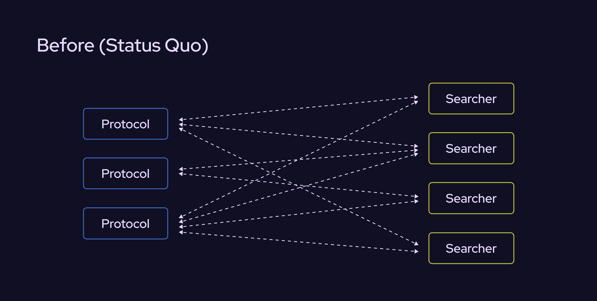
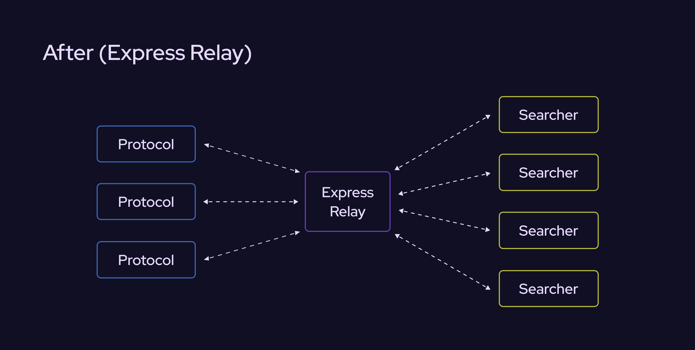

# Opportunities

In the context of Express Relay, an opportunity refers to a potential transaction that a searcher can execute on a protocol. Typically, the term "opportunity" is used for such transactions that are lucrative and therefore competed for by many searchers.

In the pre-Express Relay world, opportunities corresponded to MEV: a protocol generated MEV when an opportunity appeared on that protocol and searchers bid up the right to execute the opportunity at the validator level.

In the context of Express Relay, the value deriving from an opportunity no longer flows to the validator but instead is recaptured by the system and shared back with the protocol. In Express Relay, protocols expose opportunities to the network of integrated searchers, and the searchers then bid on priority to execute those opportunities. Critically, the auction has moved from being determined by validators to a lower level of the stack (the protocol level).

## Oracle-agnostic

Opportunities do not refer to only transactions that use an oracle. In truth, any transaction that is lucrative but limited (available to only the first user(s) who executes it) generates MEV. As a result, Express Relay and the opportunity schema have been designed to be oracle-agnostic.

Examples of opportunities include:

- liquidations
- open trade offers
- NFT mints
- top-of-block DEX arbitrage

## Opportunity Adapter

The Opportunity Adapter contract enables searchers to engage with opportunities from different protocols without needing to do any bespoke integration work per protocol. Instead of exposing lower-level fields determined by protocols (e.g. `amountCollateral`, `addressBorrower`), the Opportunity Adapter abstracts away the semantics of the opportunity and instead [exposes the fundamental traits](https://github.com/pyth-network/per/blob/30c3fc695034f518225f8255ebe8423604e8aca3/contracts/src/opportunity-adapter/Structs.sol#L20-L23) of any opportunity:

- the tokens sold by the searcher
- the tokens bought by the searcher
- the identity of the searcher executing this opportunity
- the contract to call and the calldata and value to call with
- the user's bid

Thus, the Opportunity Adapter unifies the disparate interfaces of different protocols with respect to their different opportunities. This unification in a single interface is what makes Express Relay an opportunity hub connecting protocols and searchers.

To use the Opportunity Adapter workflow, a searcher submits a bid with the target contract set to the `OpportunityAdapterFactory` contract. The factory contract then routes the searcher's transaction to their respective `OpportunityAdapter` contract. Each searcher has their own `OpportunityAdapter` contract per chain that is automatically created for them when they first interact with `OpportunityAdapterFactory`.

### Permit2

The `OpportunityAdapter` contract uses the [Permit2](https://github.com/Uniswap/permit2) token approval system, which handles the validation of a searcher's signature. Permit2 enables users to authorize token approvals for specific transaction data. In combination with Permit2, `OpportunityAdapter` allows a searcher to authorize use of their tokens only with a call to a particular contract with specified calldata and conditional on receipt of a set of specified `buyTokens`.

## Opportunity Server

Once on-chain opportunities arise, searchers can be notified of their existence via the opportunity server. Like the auction server, this is an off-chain piece of the Express Relay stack that is run by an infrastructure partner designated by the DAO. The opportunity server presents opportunities to searchers in a way that abstracts away bespoke integration work for the searcher: instead of worrying about crafting calldata specific to every new liquidation interface, searchers now view liquidation opportunities in terms of tokens they need to sell (debt they repay) in exchange for tokens they buy (collateral they liquidate). This simplified interface unifies different liquidation schemas and allows searchers to easily plug into more protocols.

In addition to learning about present opportunities, searchers can also query the opportunity server for data about historical opportunities.

The diagrams above illustrate the difference between the nature of integrations pre- and post-Express Relay. In the status quo, each searcher must connect to every new protocol with a custom integration. Similarly, protocols have to court and incentivize individual searchers. This creates a lot of integration overhead and friction for both parties.

With Express Relay, the integration is abstracted away, and searchers can connect to all current and future Express Relay-integrated protocols by **integrating once** with Express Relay. On the other hand, protocols that integrate with Express Relay gain access to the network of searchers integrated with Express Relay.

## Opportunity Monitor

Many integrated protocols with Express Relay build out an opportunity monitor script to query executable opportunities on their protocol and expose them to searchers. This allows them to tap into all Express Relay-integrated searchers, who do not need to do any additional integration work beyond having access to the relevant tokens to execute opportunities on the protocol.

In terms of existing infrastructure, the opportunity monitor script is most analogous to a protocol's liquidation scripts/bots. Typically, many lending protocols build liquidation bot libraries that they share publicly in hopes of encouraging adoption by liquidators. With minor modifications, these scripts can serve as the opportunity monitor that enables all Express Relay-integrated searchers to participate in this protocol's liquidations.
