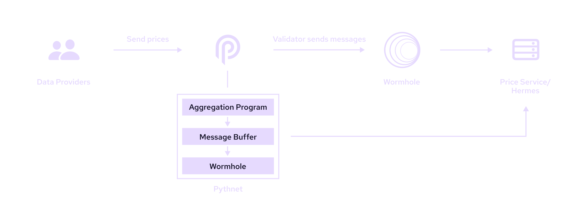

# Cross-chain

Pyth uses a cross-chain mechanism to transfer prices from [Pythnet](pythnet.md) to target chains. The diagram below
shows how prices are delivered from Pythnet to target chains:

Data providers publish their prices on Pythnet. The on-chain [oracle program](oracle-program.md) then aggregates prices
for a feed to obtain the aggregate price and confidence. Next, the Pythnet validators send a Wormhole message on each
Pythnet slot to the Wormhole contract on Pythnet containing the Merkle root of all the prices. Wormhole guardians
then observe the Merkle root message and create a signed VAA for the Merkle root message.

[Hermes](./hermes) continually listens to Wormhole for Pyth Merkle roots at each slot. It also
listens to Pythnet to get all the price messages. It stores the latest price messages with their Merkle proof and signed
Merkle root in memory and exposes HTTP and server-side streaming APIs for retrieving the latest update. (Anyone can run an instance
of this webservice, but the Pyth Data Association runs a public instance for convenience.) When a user wants to use a
Pyth price in a transaction, they retrieve the latest update message from Hermes and submit it in their transaction. The
update message includes the signed Merkle tree root, along with the Merkle proofs of each included price update. To
verify the payload, the Pyth Network contract simply checks the Wormhole signatures on the root, then checks the Merkle
proofs and, if it is valid, stores the new price in its on-chain storage.

Finally, on-chain protocols integrate with the Pyth contract via a simple API that retrieves the current Pyth price from
its on-chain storage. This API will return the current price as long as it has been updated sufficiently recently; this
approach works because users will have updated the Pyth price earlier in the same transaction. Protocols can configure
the recency threshold to suit their needs — e.g., latency sensitive applications can set a lower threshold than the
default.
