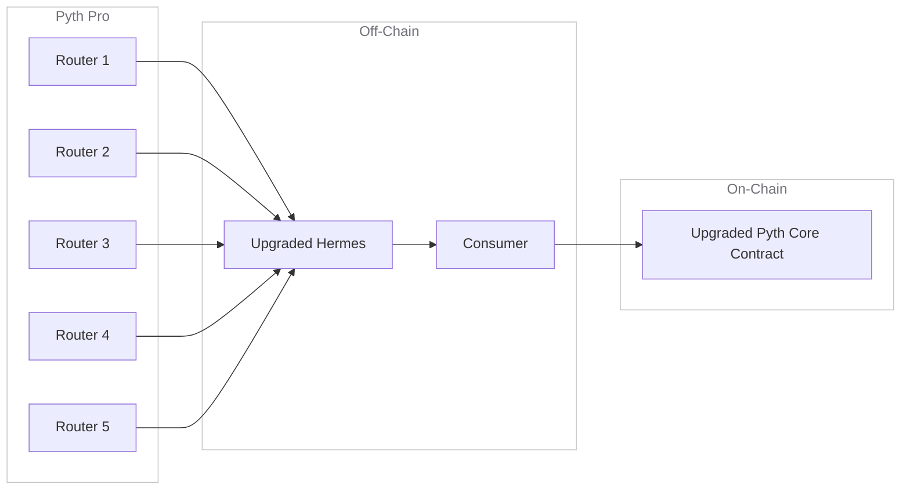

The upgraded Pyth Core leverages the high-performance
[Pyth Pro architecture](/price-feeds/pro) while preserving the existing
interfaces, so existing integrations work with no code changes. This page
explains the new architecture and how it works.

## Architecture Overview

## Data flow

1. **Aggregate & Sign**: Each tick, the five Pyth Pro routers independently
   compute the price aggregates for all price feeds, compress them into a
   Merkle tree using Pythnet's leaf format, and sign the resulting Merkle root.
2. **Data Collection**: The upgraded Hermes endpoint gathers the signed roots and
   price messages from all routers.
3. **Update Submission**: Consumers fetch the signed root and Merkle proofs from
   Hermes and submit them to the upgraded contract.
4. **On-Chain Verification**: The upgraded contracts verify that the router
   signatures meet the quorum and validate the requested price aggregate against the Merkle
   root.

## Components

### Routers

The network consists of five independently operated routers. They use the same
ECDSA signature scheme as the existing Wormhole guardians.

### Upgraded Hermes endpoint

The upgraded Hermes endpoint is hosted at a new URL but remains completely
backward-compatible with standard Hermes. It exposes the identical HTTP and
WebSocket API endpoints and returns the same payload structures.

### Upgraded Pyth Core Contract

These are newly deployed contracts on each supported blockchain. They share
the exact same ABI and interface as the legacy contracts, eliminating the
need for any downstream code modifications.

## Comparison: Existing vs. Upgraded Pyth Core

While the upgraded Pyth Core is designed to be fully compatible with existing
contracts and tools, there are key differences in how the underlying data is
aggregated, signed, and verified.

Here is a side-by-side comparison of the two architectures:

| Feature | Existing Pyth Core | Upgraded Pyth Core |
| :--- | :--- | :--- |
| **Data Sourcing & Root Production** | Pythnet | 5 Independent Routers (via Pyth Pro) |
| **Signer Network** | Wormhole Guardians | 5 Independent Routers |
| **Quorum Threshold** | **13/19** Signatures | **3/5** Signatures |
| **Signature Scheme** | ECDSA (Secp256k1) | ECDSA (Secp256k1) *(Same)* |
| **Hermes Compatibility** | Standard Hermes Endpoint | Upgraded Hermes Endpoint (Same API) |
| **Contract ABI** | Existing ABI | Identical ABI (Deployed at New Addresses) |

## What this means for consumers

Pyth Core will be upgraded on **August 18**. To avoid potential oracle downtime,
make sure you take the appropriate steps by following the [upgrade guide](/price-feeds/core/upgrade/preparing).
You can also view the [upgraded Pyth Core Contract addresses](/price-feeds/core/upgrade/contracts)
for the new contract addresses on each supported chain.
