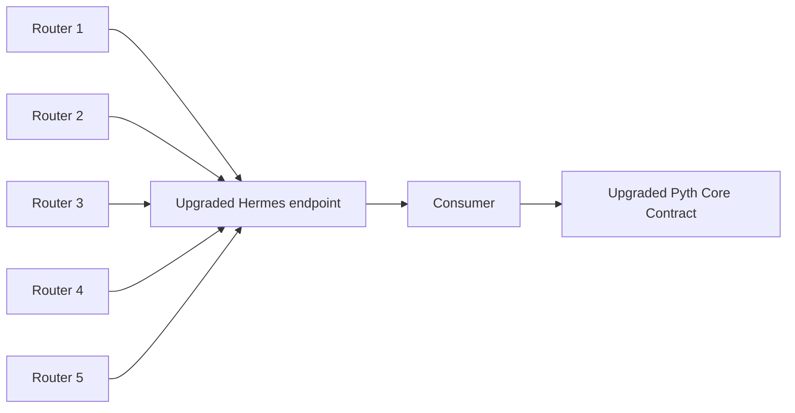

The Pyth Core upgrade preserves the existing contract interface and Hermes API surface, so existing integrations work without code changes.
Only the signers and the source of the data change. This page explains the new architecture and how it works.

## Architecture

## Data flow

Each tick, routers take the latest aggregated prices from Pyth Pro and construct a Merkle tree using the same leaf format Pythnet uses for Pyth Core. Each router signs the Merkle root independently. The upgraded Hermes endpoint collects roots and price messages from all routers and serves the latest update — the signed root plus per-price Merkle proofs. It does this through the same HTTP and streaming endpoints as Hermes. Consumers fetch the update and submit it to the upgraded Pyth Core Contract, which verifies the router signatures meet quorum and then verifies each price against the root using its Merkle proof.

The shape of this flow mirrors Pyth Core. The difference is where the Merkle root comes from and who signs it: on the existing system, Pythnet produces the root and Wormhole guardians sign it; in the upgrade, the routers do both.

## Components

### Routers

Routers build a Merkle tree over the upgraded price aggregate each tick and sign the root. The leaf format matches Pythnet's exactly, which is what makes the resulting update payload byte-compatible with Pyth Core. Five routers, operated independently, each sign the root using the same signature scheme Wormhole guardians use on the existing system.

On the existing Pyth Core, Wormhole guardians observe a Merkle root produced on Pythnet and sign it. With the upgrade, the routers both produce and sign the root.

### Upgraded Hermes endpoint

The upgraded Hermes endpoint exposes the same API as traditional Hermes — the same endpoints and the same response shapes — at a different URL. It collects signed roots and price messages from all five routers and serves the latest update with the signed root and per-price Merkle proofs. Existing Hermes clients work unchanged when pointed at the upgraded endpoint.

### Upgraded Pyth Core Contract

New contracts are deployed at new addresses on the same chains as the existing Pyth Core contracts. They expose the same ABI, so existing integrations work without code changes. The contracts are configured to accept signatures from the five routers with a **3/5** quorum, compared to the existing system's **13/19** Wormhole guardian quorum.

## What this means for consumers

Upgrading your Pyth Core integration requires two changes: point the client at the upgraded Hermes endpoint, and use the upgraded Pyth Core Contract address in place of the existing Pyth Core contract address. SDK code, payload parsing, and update submission all stay the same.

See the [upgrade guide](/price-feeds/core/upgrade/preparing) for the full upgrade path, or the [upgraded Pyth Core Contract addresses](/price-feeds/core/upgrade/contracts) for per-chain addresses.
