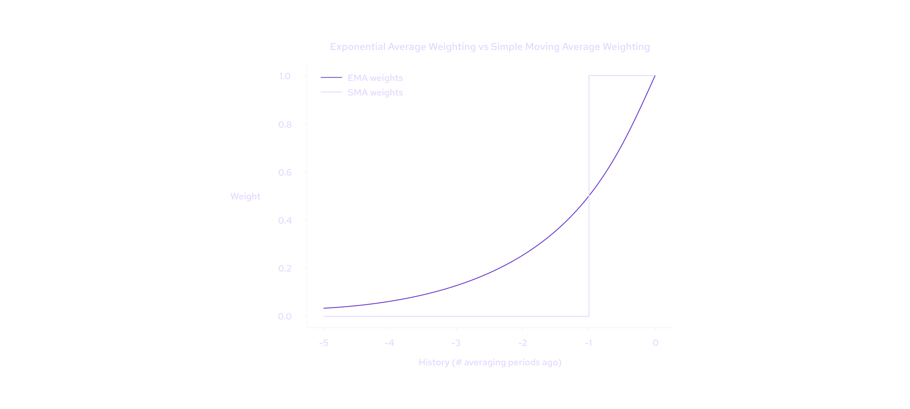
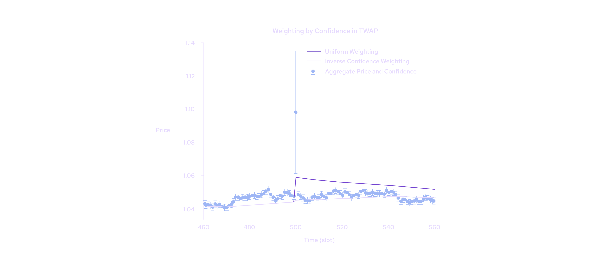

# EMA Price Aggregation

Pyth network also offers an exponentially-weighted moving average (EMA) price and confidence. These values are time-weighted averages of the aggregate price and confidence. For more details, please read out [Medium Blog](https://pythnetwork.medium.com/whats-in-a-name-302a03e6c3e1) on the topic.

Both the EMA price (ema_price) and confidence (ema_confidence) are available from Pyth price accounts:

```sh copy
price_account .. CqFJLrT4rSpA46RQkVYWn8tdBDuQ7p7RXcp6Um76oaph
    price ........ 16297000 x 10^-5
    conf ......... 27952 x 10^-5
    price_type ... price
    exponent ..... -5
    status ....... trading
    corp_act ..... nocorpact
    num_qt ....... 2
    valid_slot ... 110430111
    publish_slot . 110430112
    ema_price ......... 16247409 x 10^-5
    ema_confidence ......... 19415 x 10^-5
```

**What is an exponential moving average (EMA)?**

In an EMA the most recent samples receive the most weight, and samples further back in time get exponentially less weight the farther in the past they are. For a 1 hour EMA, the samples 1 hour in the past get 50% of the weighting, samples 2 hours in the past get 25% of the weighting, 3 hours in the past get 12.5% of the weighting, etc.



While conceptually not as simple as an SMA (Simple Moving Average), the EMA has a particularly simple implementation for streaming applications such as Pyth. The exponential weighting method allows the entire history of prices and weights to be represented by a single number.

Find the implementation in [GitHub](https://github.com/pyth-network/pyth-client/blob/852b991fb4403dcf23043752e3a799a40ed0133b/program/src/oracle/upd_aggregate.h).

**How does Pyth calculate its EMA Price and EMA Confidence?**

The EMA Price (`ema_price`) and EMA Confidence (`ema_confidence`) values are derived directly from the aggregated prices and confidences Pyth has generated on-chain. Publishers do not submit either EMA Price or EMA Confidence values, they only publish to Pythnet a “live” price and its associated confidence interval which will, in turn, be used for EMA Price and EMA Confidence calculation.

The current Pyth averaging method is a slot-weighted, inverse confidence-weighted exponential moving average of the aggregate price (and confidence interval).

- **Slot weighted** — The Pyth EMA uses the Pythnet slot number to measure the passage of time. The averaging period is 5921 slots, which corresponds to approximately 1 hour on Pythnet.
- **Inverse confidence weighted** — Weighting each sample by 1/Confidence lets the EMA give more weight to samples with tight confidence and ignore samples with very wide confidence. Below is an example of an outlier aggregate price with a wide confidence interval. Notice how the average using inverse confidence weighting does not get pulled up by the outlier sample while the uniform weighted average does.



For more details and explanations, be sure to read the dedicated blog post on this topic [here](https://pythnetwork.medium.com/whats-in-a-name-302a03e6c3e1).
