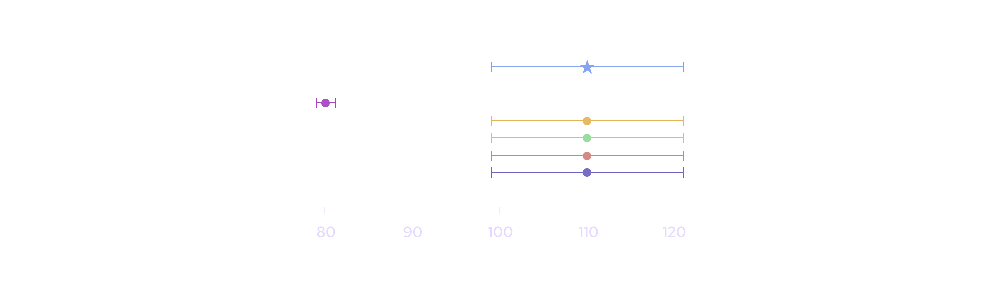
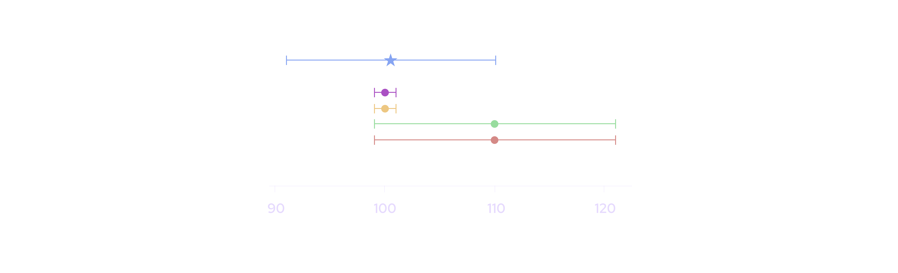
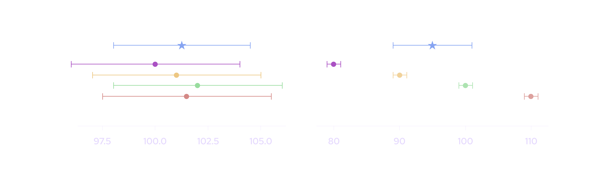
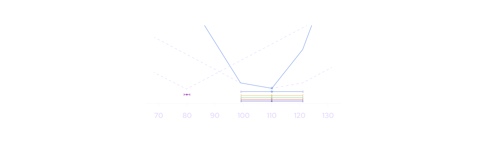
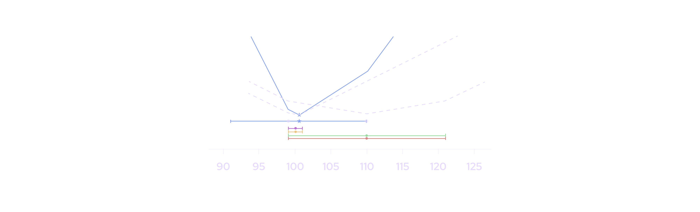
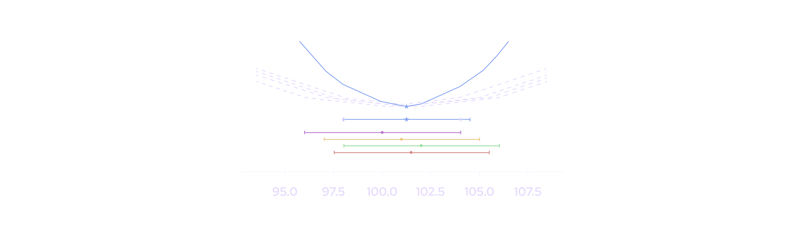
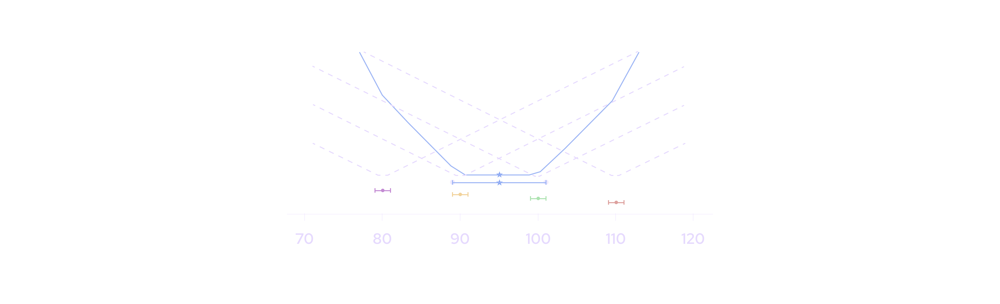

# Price Aggregation

Price aggregation combines the prices and confidences submitted by individual data providers into a single aggregate price and confidence.

**Design Goals**

The aggregation algorithm is designed to achieve 3 properties. First, it must be **robust to manipulation.** If most publishers are submitting a price of \$100 and one publisher submits a price of \$80, the aggregate price should remain near \$100 and not be overly influenced by the single outlying price. In the figure below, the aggregate price and confidence interval (represented by the blue star) is not influenced by the magenta publisher whose price is far away from the other publishers:

Second, the **aggregate price should appropriately weight data sources with different levels of accuracy.** Pyth allows publishers to submit a confidence interval because they have varying levels of accuracy in observing the price of a product. This property can result in situations where one publisher reports a price of \$101 +/- 1, and another reports \$110 +/- 10. In these cases, aggregating the price to be closer to \$101 than \$110 is appropriate, as in the figure below.

Finally, the **aggregate confidence interval should reflect the variation between publishers' prices.**
Under normal market conditions, it is reasonable to expect a product to trade at a similar price across exchanges.
In these cases, aggregate confidence interval is preferable to reflect the confidence intervals of the individual data providers, as shown in the figure on the left.
However, in some rare situations, a product can trade at different prices on different exchanges.
In these cases, the aggregate confidence interval should widen out to reflect the variation between these prices, as shown in the figure on the right.

**Algorithm**

The aggregation algorithm itself is a simple two-step process.
The first step computes the aggregate price by giving each publisher three votes — one vote at their price and one vote at each of their price +/- their confidence interval — then taking the median of all the votes.
The second step computes the distance from the aggregate price to the 25th and 75th percentiles of the votes, and then selects the larger of the two as the aggregate confidence interval.

This process acts like a hybrid between a mean and a median, giving confident publishers more influence, while still capping the maximum influence of any single publisher.
The algorithm has an interpretation as computing the minimum of an objective function that penalizes the aggregate price from deviating too far from the publishers' prices.
This interpretation allows properties of the algorithm's behavior to be proved: for example, the aggregate price will always lie between the 25th and 75th percentiles of the publishers' prices.

**Scenarios**

The operation of this algorithm and objective function can be visualized in the 4 scenarios described above.
In the following graphs, the colored bars represent each publisher's price and confidence interval, and the grey dashed lines above depict the publisher's contribution to the overall objective function.
The red line represents the combined objective function, that is, the sum of the dashed grey lines.
The grey circles represent the 25th and 75th percentiles of the votes — the further one of these from the aggregate price determines the confidence interval’s width.
Finally, the bold red star depicts the aggregate price and the bold red line depicts the aggregate confidence interval.

In the first scenario, one publisher with a tight confidence interval is an outlier.
Although this publisher does influence the objective function (the red line is lower on the left side than the right), it does not have enough influence to affect either the aggregate price or confidence interval.

The second scenario depicts how publishers with tighter confidence intervals can exert more influence over the location of the aggregate price, as long as their prices are consistent with the confidence intervals of other publishers.

The third scenario demonstrates the typical case where there are many publishers whose prices and confidence intervals roughly agree.
In this case, the desired behavior is for the aggregate price and confidence to reflect those of the individual publishers.

Finally, the fourth scenario considers the case where the publishers publish distinct prices with non-overlapping confidence intervals.
In this case, the confidence interval widens out because the dispersion between publishers creates a large gap between the aggregate price and the 25th/75th percentiles of the votes.

**Further Reading**

For more details on the aggregation algorithm and some of the theory behind it, please see the [price aggregation blog post](https://pythnetwork.medium.com/pyth-price-aggregation-proposal-770bfb686641).
