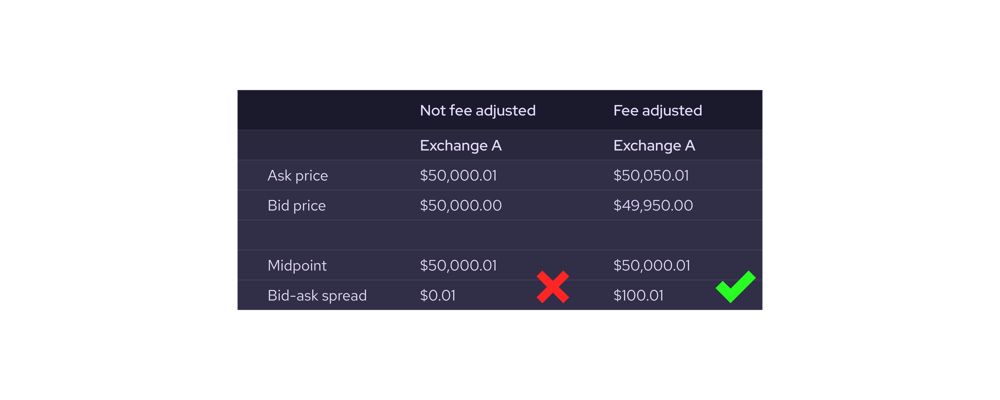
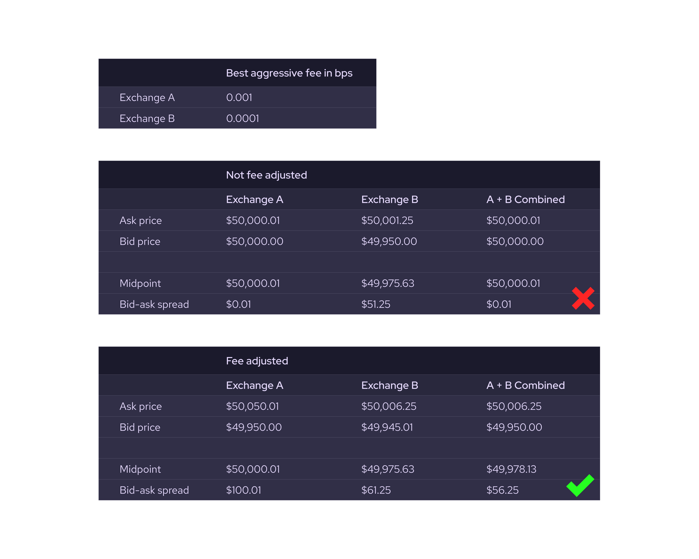

# Confidence Interval and Crypto Exchange Fees

It is very important that publishers consider crypto exchange aggressive fees when calculating their price and confidence intervals from one or more exchange order books. Ask prices should be moved up by the best publicly available aggressive fee rate, and bid prices should be moved down by the same rate.

```sh copy
ask_adjusted = ask * (1.0 + fee_rate)
bid_adjusted = bid * (1.0 - fee_rate)
```

This is to reflect the "after fee" effective prices that could be gotten on that exchange. This is important for crypto markets because the fees are often MUCH larger than the typical bid-ask spread. It is not important for other markets (such as US equities) where fees are small compared with the bid-ask spread. The rationale for this adjustment is that the "fair price" could be above the best ask or below the best bid by as much as the aggressive fees before an informed trader would be able to profitably trade on this exchange and move the best price. Because of that, the best price on the exchange could be "wrong" by as much as +/- the aggressive fees.

Example 1 - Exchange A has best aggressive fee of 10bps



Exchange A should publish a price of \$50,000.01 and a confidence of \$50.005 (half the bid-ask spread after fee adjustment). It would be wrong to publish a confidence of \$0.005 based on the "not fee-adjusted" raw exchange bid-ask spread.

Example 2 - Exchange A has a best aggressive fee of 10bps. Exchange B has a best aggressive fee of 1bps, and a publisher is combining them into a single combined book. Exchange books are combined by taking the best ask across both exchanges and the best bid across both exchanges.



In this example, if a publisher were combining the books of Exchange A and Exchange B to get a combined price, they should publish a price of \$49,978.13 and confidence of \$28.125, which corresponds to the midprice and half the bid-ask spread of the combined fee-adjusted books. It would be wrong to publish a price of \$50,000.01 and confidence of \$0.01 based on the "not fee-adjusted" raw exchange prices. Note that in this example, not only is the confidence changed by including the exchange fees, but the price reported is also substantially different once fees are properly accounted for.
