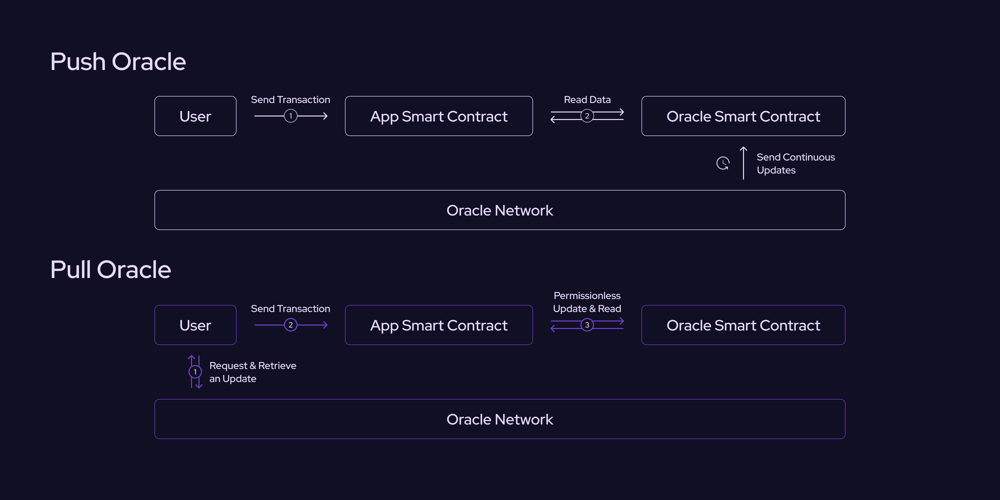

# What is a Pull Oracle?

Most oracles today are push oracles where the oracle operator is responsible for submitting price updates to the blockchain.
Pyth is different: it is a _pull oracle_ where anyone can permissionlessly update the on-chain price.
This document explains the differences between push and pull oracles.

## Push Oracles

_Push oracles_ periodically update an on-chain price based on external trigger conditions.
The oracle has a smart contract that stores the current price.
The contract also has a set of permissioned operators who are authorized to update the price.
The oracle operators then commit to updating the on-chain price at a specific cadence, for example, once every 30 minutes or if the price moves by 1%.
Thus, in a push oracle, the on-chain price is periodically updated, regardless of whether or not anyone is using it.

## Pull Oracles

In contrast to push oracles, _pull oracles_ only update the on-chain price when requested.
There are different ways for users to request an updated price from a pull oracle.
Some pull oracles respond to on-chain requests: applications send one transaction to request data from the oracle, which then submits the response in a second transaction.
Pyth uses a simpler system where users can request the latest price update from an off-chain service.
Anyone can submit a price update to the on-chain Pyth contract, which verifies its authenticity and stores it for later use.
This system allows applications to use a single transaction flow that first updates the price then performs the necessary application logic.

For a more in-depth explanation on the differences between push and pull oracles, refer to the following video tutorial:
[How to Build with Pyth's Pull Oracle Design: Pyth Tutorials](https://youtu.be/qdwrs23Qc9g)

## Comparing Push and Pull

Push and pull oracles differ on a number of important dimensions:

- **Update frequency** -- In a push oracle, every price feed updates at a fixed update frequency.
  The oracle operator determines the frequency, but it typically ranges from every 10 minutes to 1 hour.
  In contrast, pull oracles can update at a much higher frequency.
  For example, every Pyth price feed updates every 400 milliseconds.
- **Latency** -- An oracle's update frequency also affects its prices' latency.
  The higher update frequencies of pull oracles allow applications to access lower-latency data.
- **Blockchain support** -- Pull oracles support a wide variety of different blockchains.
  Push oracles typically support a smaller number of blockchains, as each additional chain requires ongoing gas expenditures.
- **Price feed selection** -- Similar to the item above, pull oracles also support a wide selection of price feeds.
  In contrast, push oracles typically have a more limited selection.
  Push oracles generally cannot support a wide selection of feeds due to the gas cost of periodically updating each feed.

A fundamental reason for these differences is that push oracles incur gas costs for price updates.
These gas costs limit their scalability across all of the dimensions above.

### Integration Differences

Push oracles and pull oracles require applications to integrate in different ways.
With a push oracle, applications typically read the current price out of a smart contract.
Since the push oracle periodically updates the price, the application can assume the data in the smart contract is (reasonably) fresh.
With a pull oracle, applications need to update the on-chain price before reading it.
Developers using Pyth can refer to [How to Use Real-Time Price Data](/price-feeds/use-real-time-data) to learn how to perform these steps.
