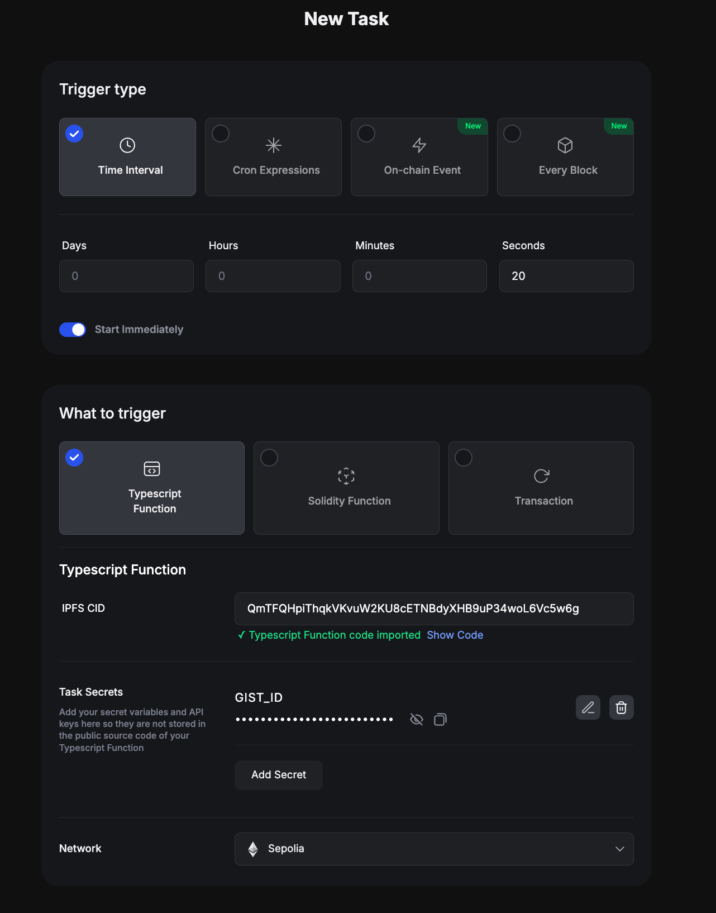
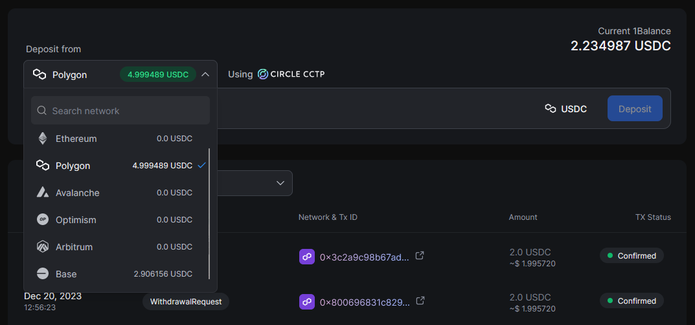
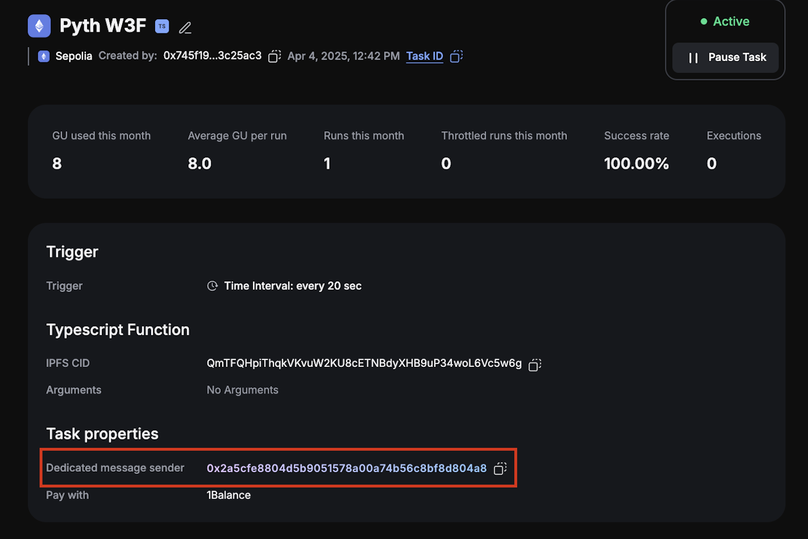
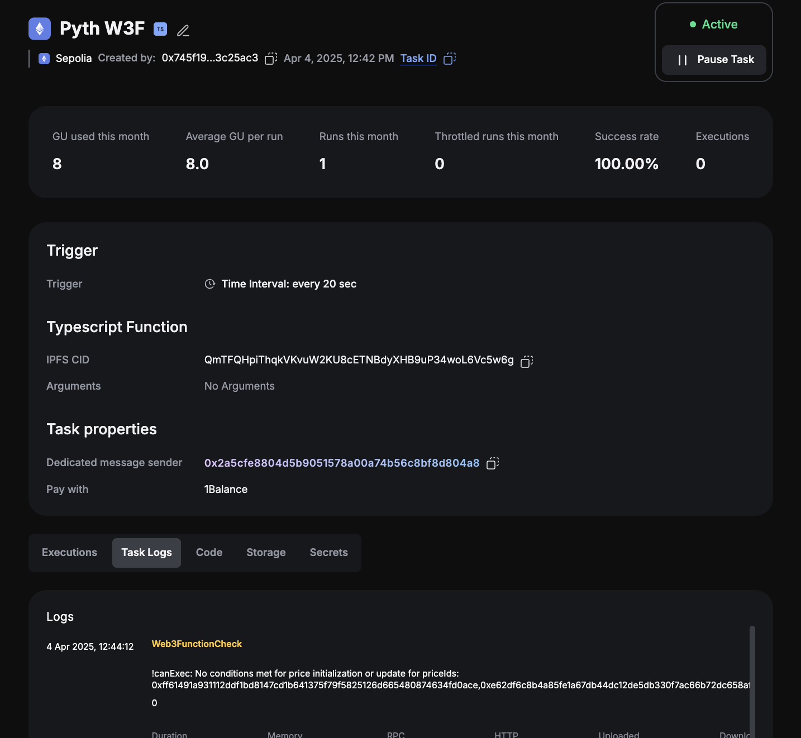
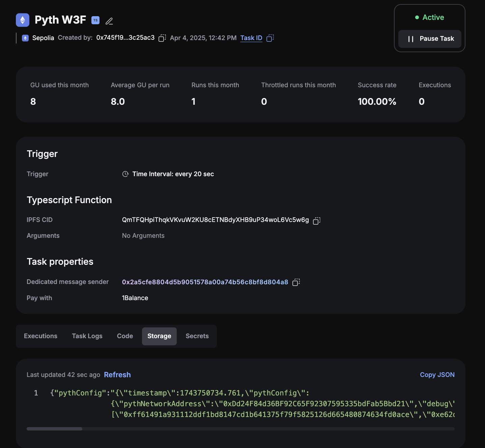

# How to Schedule Price Updates with Gelato

This guide explains how to create an automated Gelato task that updates Pyth price feeds on a schedule. The task will
update the on-chain price after either a fixed time interval or if the price has changed by a certain percentage.

### Introduction to Gelato

[Gelato](https://www.gelato.network/) is web3’s decentralized backend empowering developers to create augmented smart contracts that are automated,
gasless and off-chain aware on all major EVM-compatible blockchains. Gelato offers Web3 Functions (W3F) that connect your
smart contracts to off-chain data and computation by running decentralized cloud functions.

### Gelato W3F Pyth Task

The Gelato W3F Pyth Task is a Gelato task that updates Pyth price feeds on a schedule.
The task is deployed to IPFS and can be used by anyone to schedule price updates for any Pyth price feed.
The task is configured via file called `config.yaml` which contains various parameters such as the price
feeds to update, the update frequency, price deviation threshold.

## Steps

#### 1. Join Gelato Web3 Functions whitelist

Web3 functions like Solidity functions and automated transactions can be used directly. However, to use TypeScript-based Web3 Functions, you must be added to the whitelist.
To apply, please reach out to the Gelato team for access [here](https://discord.com/invite/ApbA39BKyJ).

#### 2. Configure your task

[//]: # "TODO: redirect this to pyth fork of repo)"

The Gelato task reads a yaml configuration file from a GitHub gist.
Create a GitHub gist by logging into GitHub and navigating to [here](https://gist.github.com/). Add a file called `config.yaml`.
Copy the [example gist](https://gist.github.com/swimricky/18b2a5ad9c1a605f1cf5c19ac1d2f1d9) and edit the parameters for
the environment you're deploying to and configure your price feeds and update thresholds. See
[directory](https://github.com/pyth-network/w3f-pyth-poc-v2/tree/master/web3-functions/pyth-oracle-w3f-priceIds) for
some example configuration files. These parameters can be updated at any time by editing the gist even if the task has
already been deployed. The task will automatically pick up these configuration changes and use them for subsequent executions.

#### 3. Create the task

Use the link below to auto-populate the task parameters with the Pyth web3 function code:

https://app.gelato.network/new-task?cid=QmTFQHpiThqkVKvuW2KU8cETNBdyXHB9uP34woL6Vc5w6g

The pyth web3 function code is deployed to IPFS, so you can use it via the cid/link above.
You can find a copy of the web3 function code [here](https://github.com/pyth-network/w3f-pyth-poc-v2/tree/master/web3-functions/pyth-oracle-w3f-priceIds)

Choose network, and then in the "Task secrets" section, set `GIST_ID` to the gistId of the gist you created in step 2.

**Note that the free tier have certain limits, Checkout all subscription plans and choose the one that best fits your needs [here](https://app.gelato.network/1balance/subscriptions/functions?networkGroup=mainnets&type=monthly)**.

#### 4. Fund the task

There are two sets of fees that must be paid before the task can execute successfully :

**Gelato Fees**

Gelato's fees are paid through [1Balance](https://docs.gelato.network/web3-services/1balance). Once you are
whitelisted, visit the 1Balance section on [Gelato app](https://app.gelato.network/1balance) and deposit USDC on Polygon to top up
your Gelato balance which will be used to pay the Gelato fees on all supported chains. These include computational costs
and transaction gas fees. Testnet executions are subsidized by Gelato and free.
Note : You can deposit USDC from any chain supported by Circle CCTP.

Deposit USDC

**Pyth Fees**

Updating a pyth price feed requires the caller to pay a small fee. Pyth fees are paid in the native token of the chain
where the task is running. The method that updates the price is payable and the update transaction has to include the
corresponding fee in the `msg.value`.

The on-chain transaction executed via a web3 function gets routed through a proxy smart contract
which is solely owned by the web3 function task creator. This proxy smart contract is known as the `dedicatedMsgSender`
and will be deployed the first time a task is created for a given wallet address.

Pyth fees are paid by the `dedicatedMsgSender` and transaction fees as well as computational costs by 1Balance.
You will need to transfer over the native tokens to `dedicatedMsgSender` on every chain where you want to run
the task using a standard transfer. The `dedicatedMsgSender` address can be found in the Gelato App settings and on the Task dashboard as well.

You can simply open your wallet and send native tokens to `dedicatedMsgSender` on the chain(s) where you want to run the
task.

#### 5. Check task execution

Once your task has been successfully created, you can check the task execution details on the Task dashboard in the Gelato app.

## Managing your Gelato Task

#### Monitoring

To ensure that your tasks are running as expected, you can set up monitoring. Gelato supports monitoring 1Balance and
address balances as well as execution statuses for tasks. You can set up monitoring for your Gelato balance and
the `dedicatedMsgSender` address on each chain where you are running tasks and receive notifications in either
Telegram or Discord.

See the following links for more information:

- [1Balance Alerts](https://docs.gelato.network/web3-services/1balance/1balance-alerts)
- [Balance Alerts](https://docs.gelato.network/web3-services/web3-functions/analytics-and-monitoring)

#### Updating configuration

To update the configuration of your task, such as adding/removing new price feeds or changing the deviation thresholds,
you can simply update the `config.yaml` file in your gist. The task will automatically pick up the changes and use them.
Note that the `config.yaml` includes a `configRefreshRateInSeconds` parameter which determines how often the task will
fetch the latest configuration from the gist vs reading a locally cached version. This is to prevent the task from being
rate-limited by GitHub. To verify that your most recent task execution used the latest configuration, you can check the
"Storage" tab on the task details page and look at the configuration stored under the `pythConfig` key.

## Notes

If you want to customize the behavior of the web3 function beyond what is supported by updating the config.yaml, you can
clone this [repo](https://github.com/pyth-network/w3f-pyth-poc-v2) and deploy your own version of the web3 function.
You can then use the cid of your deployed web3 function to create a new task. See [README.md](https://github.com/pyth-network/w3f-pyth-poc-v2/tree/master/web3-functions/pyth-oracle-w3f-priceIds/README.md) and
[Gelato Web3 Function Documentation](https://docs.gelato.network/web3-services/web3-functions) for more details.
