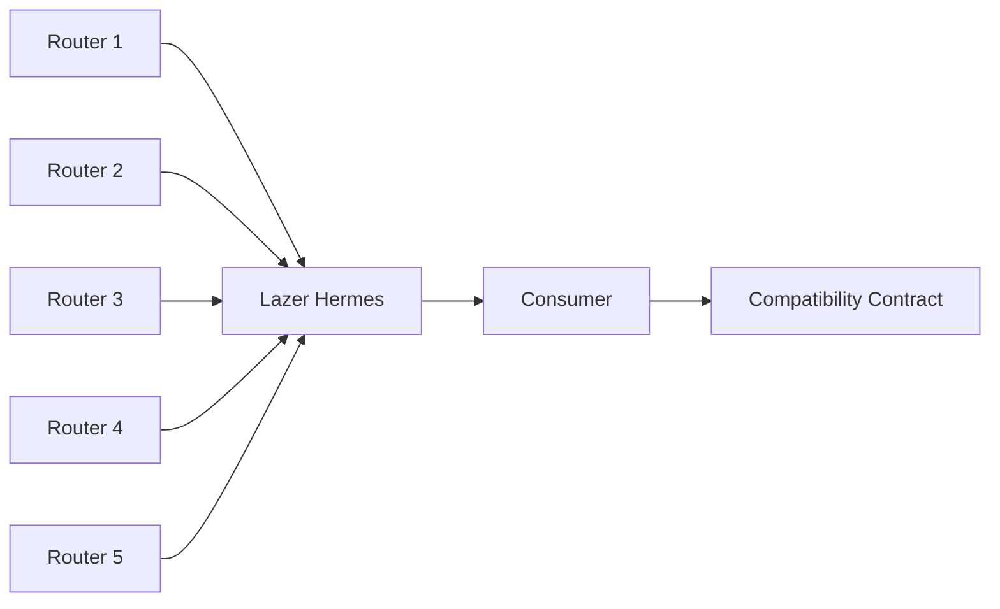

The Pyth Pro compatibility layer lets consumers of the Pyth Core contract interface receive Pyth Pro data without changing their integration. The update payload format and the on-chain contract ABI are identical to Core — only the source of the data and the entities that sign it are different.

## Architecture Diagram

## Data Flow

Each tick, routers take the latest aggregated Pyth Pro prices and construct a Merkle tree using the same leaf format Pythnet uses for Pyth Core. Each router signs the Merkle root independently. Lazer Hermes collects roots and price messages from all routers and serves the latest update — the signed root plus per-price Merkle proofs — through the same HTTP and streaming endpoints as Hermes. Consumers fetch the update and submit it to the compatibility contracts, which verify the router signatures meet quorum and then verify each price against the root using its Merkle proof.

The shape of this flow mirrors Pyth Core. The difference is where the Merkle root comes from and who signs it: on Core, Pythnet produces the root and Wormhole guardians sign it; here, the routers do both.

## Components

### Routers

Routers build a Merkle tree over Pyth Pro prices each tick and sign the root. The leaf format matches Pythnet's exactly, which is what makes the resulting update payload byte-compatible with Pyth Core. Five routers, operated independently, each sign the root using the same signature scheme Wormhole guardians use on Core.

On Pyth Core, Wormhole guardians observe a Merkle root produced on Pythnet and sign it. With the compatibility layer, the routers both produce and sign the root.

### Lazer Hermes

Lazer Hermes exposes the same API as Hermes — the same endpoints and the same response shapes — at a different URL. It collects signed roots and price messages from all five routers and serves the latest update with the signed root and per-price Merkle proofs. Existing Hermes clients work unchanged when pointed at the Lazer Hermes URL.

### Compatibility Contracts

New contracts are deployed at new addresses on the same chains as the existing Pyth Core contracts. They expose the same ABI, so existing integrations work without code changes. The contracts are configured to accept signatures from the five routers with a **3/5** quorum, compared to Core's **13/19** Wormhole guardian quorum.

## What This Means for Consumers

Migrating a Pyth Core integration to Pyth Pro data through the compatibility layer requires two changes: point the client at the Lazer Hermes URL, and use the compatibility contract address in place of the existing Pyth Core contract address. SDK code, payload parsing, and update submission all stay the same.
