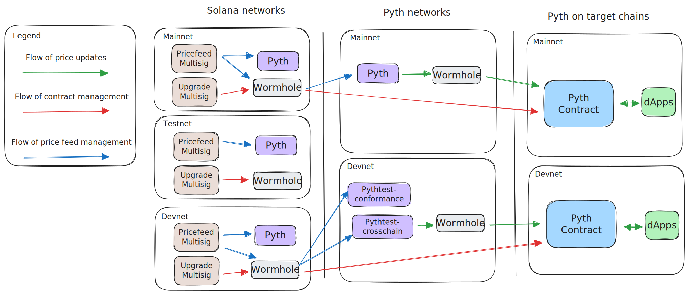

# Cross Chain Admin

A set of packages for managing pyth cross-chain communications and contract management.

Pyth programs across chains are governed by multisigs. These multisigs are managed on solana devnet, testnet, and mainnet networks and each manage certain programs on certain networks.

On each of these chains two multisigs are deployed:

- Upgrade multisig: This multisig is used to upgrade the pyth contracts (configuration or implementation) on the target chain
- Price feed multisig: This multisig is used to add or remove price feeds and publishers

Here is a diagram on which programs consume which multisig messages and how it works in general:

You can edit the diagram by opening the [overview.excalidraw](./overview.excalidraw) file in [excalidraw.com](https://excalidraw.com/).
