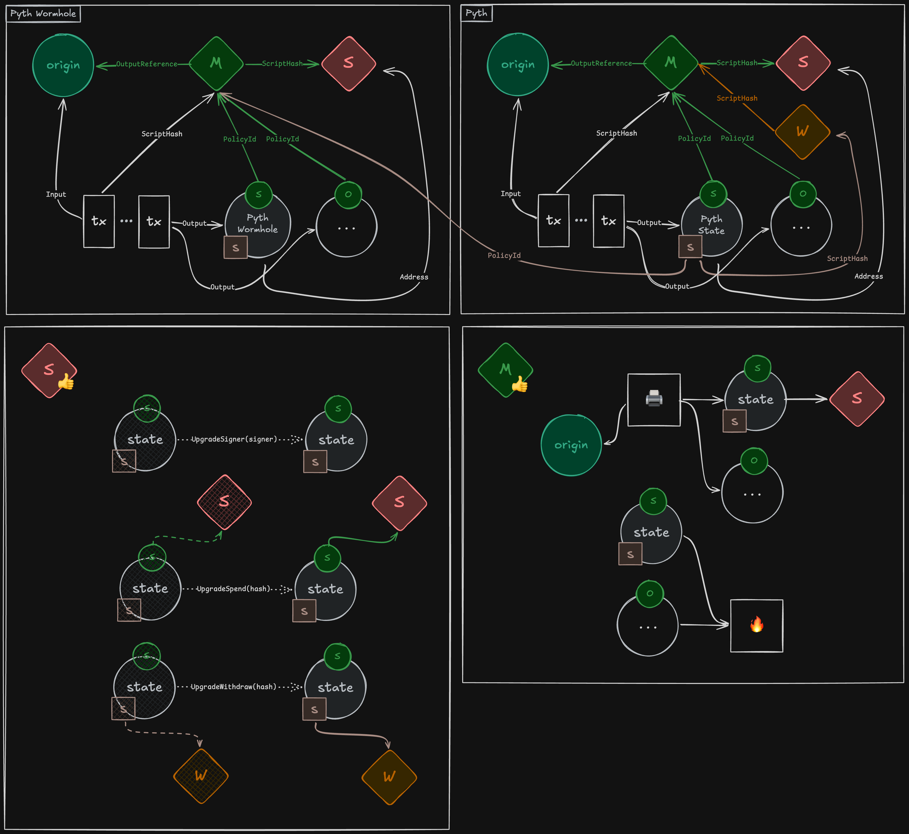

# Lazer Cardano Contract

Compared to our contracts on other chains, in Cardano we have to build up some
abstractions from first principles to make it possible to represent state of our
contract on-chain. Most of the code is there to do just that, and once we have
needed pieces in place, core of the contract is relatively simple and similar to
EVM or Sui implementation.

## Quick Cardano introduction

Instead of being account-based or object-based, Cardano uses UTxO model to
represent on-chain state. Similarly to Bitcoin, it represents assets through
outputs from previous transactions, which can be spent based on some criteria,
always have to be spent fully, and can only be spent once, basically as a sort
of digital one-time envelopes carrying cash. Difference between Bitcoin and
Cardano is that these envelopes can carry not just one, but multiple types of
tokens, where non-standard tokens are identified based on contract that minted
them, together with datums, which are arbitrary pieces of data, where one UTxO
can optionally carry a single datum as a sort of associated "note" in the
envelope.

To enable custom policies for minted tokens and programmability in general,
Cardano supports multiple types of contracts ("scripts"), where each script
handles specific type of action that can happen inside a transaction. For us,
relevant scripts are ones for minting (and/or burning) tokens, and for spending
UTxOs. Instead of having a monolithic contract that handles all the logic, we
have to implement relevant logic in corresponding scripts, or at least write
helper scripts that delegate these actions to a different one by checking for
script's presence in a transaction.

Finally, Cardano scripts are predicates (`fn(Transaction) -> Bool`), so all they
can do is verify the shape of a transaction - they can't "create" or "update"
anything. Instead, we have to separately build the transaction with both
expected inputs and outputs, and give the complete transaction to the network
for validation.

## What we need

(Ignoring some other Cardano features not relevant to us), this is basically
all we can build with, so here's the rundown of abstractions built as a part of
the contract to implement mutable state managed through governance:

### Some helper types

First, Cardano has a single integer type (`Int`), so we implement bunch of
helper types for parsing and converting differently-sized (un)signed integers
([`types/i16`], [`types/i64`], [`types/u8`], [`types/u16`], [`types/u32`], [`types/u64`]).

Second, while Cardano supports secp256k1 in general, it doesn't specifically
support recoverable signatures used by Wormhole, so to verify VAAs on-chain,
we recover keys off-chain ([`sdk/js/src/wormhole.ts`], see `recoverVaaPublicKeys`)
and pass them together with VAA bytes into the transaction as a `PreparedVAA`
(see [`wormhole/vaa`]). In the contract, we then have a helper module ([`secp256k1`])
that can convert uncompressed secp256k1 keys into both compressed keys expected
by Cardano, and ethereum-like address used as a public key identifier by
Wormhole. Because we indirectly check the recovered key against both the
signature and guardian set on-chain, we can be sure that the VAA is valid.

### Parsing

Integration with Wormhole and Lazer requires a lot of parsing, so we've ended up
creating a [`parser`] module that abstracts over `ByteArray` slicing. Actual
examples in e.g. [`wormhole/vaa`] module should be mostly self-explanatory - to
make code clean, we use backpassing syntax in Aiken, which transforms

```aiken
let b <- f(a)
c
```
into
```aiken
f(a, fn(b) { c })
```

### State abstraction

Finally, to implement mutable state on-chain, we have a [`state`] module which
implements shared abstraction for both Wormhole and Pyth contracts. Basic idea
is this:

- if all we have is one-time envelopes carrying tokens and datum, we need
  something that tells us which envelope carries our state at this moment, and
  guarantee that there can only be one such envelope, created by our contract
  
  - to do this, we mint a NFT representing identity of our state, and we pass
    that NFT to UTxO that is supposed to carry the state as its datum
  - NFT is created by binding the minting script to an arbitrary UTxO that is
    spent as part of minting transaction - because UTxO can only be spent once,
    nobody can invoke the script again for minting

- if we simply were to send the UTxO directly to us, we couldn't guarantee its
  validity into the future, as the minting script is only invoked when minting
  or burning the token

  - to solve this, we create a separate, spending script, which in Cardano
    behaves as a type of address that can receive and spend UTxOs
  - the spending script is invoked when spending the UTxO, and it will only
    allow spending for purposes of burning, or to create a new, updated UTxO,
    based on the governance action, sent directly back to the script
  - to allow spending script updates, we make it possible for governance action
    to change the return address, but it must always be a script address

[`state`] module has more comments about the design. Few more notes about usage:

We mint and burn state NFT together with "owner" NFT, in lockstep. Owner NFT
doesn't have governance privileges, it is only used for burning and performing
safe maintenance tasks, like removing expired deprecated scripts to decrease
state size. This means that contract deployer can "disable" the contract at will
(which may be useful safeguard for incidents that require quick intervention),
but doesn't affect safety of the contract, because meaning of its state can only
be altered by a valid governance action. This logic is implemented in individual
contracts.

Minting script is bound not only to origin UTxO to implement a NFT, but to
spending script hash too - this way, recompiling contracts locally and checking
minting script hash against its on-chain deployment should be enough to verify
the whole system. Without this, initial transaction could send the state UTxO
to any spending script, and we would have to check it separately to make sure
that the system is sound. We can't bind script in the other direction
simultaneously because of mutual dependency, but this doesn't affect safety, as
correct state should always be identified by minting script hash ("policy ID"),
not address where it is currently located. This is again implemented in actual
contracts.

Finally, we have no way to "update" the minting script under this design, so we
should take care to get it right, otherwise we will need users to migrate to
a different state NFT, and thus different deployment.

### Zero-withdraw trick

From user perspective, for actual price verification, we want a mechanism that
allows user to get price update "stamped" by us as part of a transaction.
Because we want this logic to be deployed by us, instead of users having to get
their copy of our logic audited, and we potentially want it to be
language-independent, we use a common trick in Cardano world - we deploy a
script used as programmable address for stake rewards from Cardano network, and
ask users to "withdraw" zero from it. This address is never going to hold any
tokens, but withdrawing 0 amount is allowed by the network, and it still
triggers the script evaluation, thus allowing us to check price updates passed
to it as an argument ("redeemer"). Thus, users can simply retrieve the redeemer
passed to our withdraw script in the transaction, and assume that it contains
valid price update data to be used for their purposes.

## Architecture

Here's the diagram of the system:



Circle nodes represent UTxOs and associated tokens, rectangle nodes represent
transactions, diamond nodes represent Mint, Spend and Withdraw scripts
respectively. Nodes are connected by references contained as part of their
representation on-chain.

Logic for Wormhole state minting and spending script can be found in [`validators/wormhole_state`].
Equivalent setup for Pyth state is in [`validators/pyth_state`], while the
withdraw script invoked by users is in [`validators/pyth_price`] module.

[`types/i16`]: ./lib/types/i16.ak
[`types/i64`]: ./lib/types/i64.ak
[`types/u8`]: ./lib/types/u8.ak
[`types/u16`]: ./lib/types/u16.ak
[`types/u32`]: ./lib/types/u32.ak
[`types/u64`]: ./lib/types/u64.ak
[`secp256k1`]: ./lib/secp256k1.ak
[`wormhole/vaa`]: ./lib/wormhole/vaa.ak
[`parser`]: ./lib/parser.ak
[`state`]: ./lib/state.ak
[`validators/wormhole_state`]: ./validators/wormhole_state.ak
[`validators/pyth_state`]: ./validators/pyth_state.ak
[`validators/pyth_price`]: ./validators/pyth_price.ak
[`sdk/js/src/wormhole.ts`]: ./sdk/js/src/wormhole.ts